# Руководство пользователя

**Приложение:** «Выше нуля»  
**Платформа:** Android (прототип по ТЗ Департамента финансов города Москвы, 2026)  
**Аудитория:** дети 7–11 лет; взрослый сопровождает, но не решает вместо ребёнка

Скриншоты сняты с релизного APK на эмуляторе: папка [`user-guide/assets/`](./user-guide/assets/).

## Назначение

Игра учит базовым навыкам карманных денег: планировать бюджет, различать
обязательное и желаемое, копить на цель и видеть последствия решений.

Ребёнок помогает **робопсу** выбраться из механической ямы: зарабатывает
монеты на заданиях и мини-играх, составляет план, покупает заряд и модули,
откладывает в копилку и оплачивает подъём яруса. Всё работает **офлайн**, без
аккаунта, рекламы и реальных платежей.

Отдельно предусмотрен **раздел для взрослого** (отчёт и демо-режим) за
арифметическим барьером.

> Источник требований: ТЗ «Питомец Финни» / Департамент финансов города Москвы.
> В игре питомец — робопёс; термины ТЗ (обязательное / желаемое / накопления)
> сохранены.

---

## Как попасть в демо-режим

**Это основной способ экспертной проверки** (п. 2.5.13 ТЗ): тестовый профиль и
пять игровых периодов подряд без ожидания календарных сроков. Профиль ребёнка
при этом **не стирается** — он паркуется и возвращается целиком после выключения
демо.

### Шаги

1. На главном экране (арена) открыть **настройки** (шестерёнка).

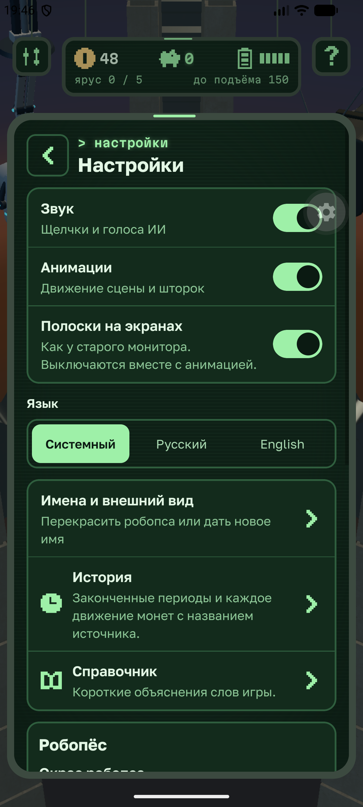

2. Пролистать вниз и нажать **«Для взрослых»**.

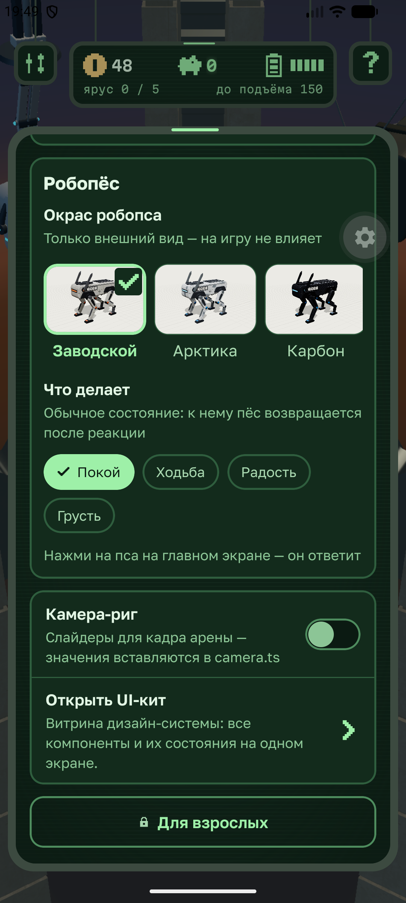

3. Пройти барьер одним из способов:
   - решить пример на умножение (множители **6…9**, например `8 × 6`);
   - **или** удерживать кнопку входа около **3 секунд**.

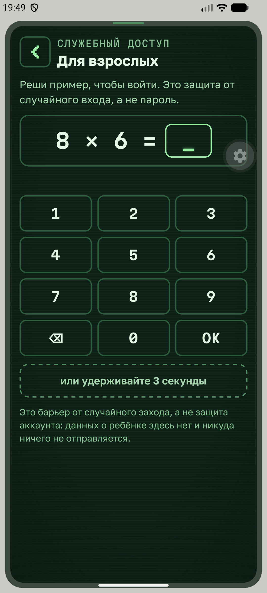

4. В разделе взрослых открыть вкладку **«Управление»**.
5. В карточке **«Демо-режим»** включить переключатель **«Тестовый профиль»**.

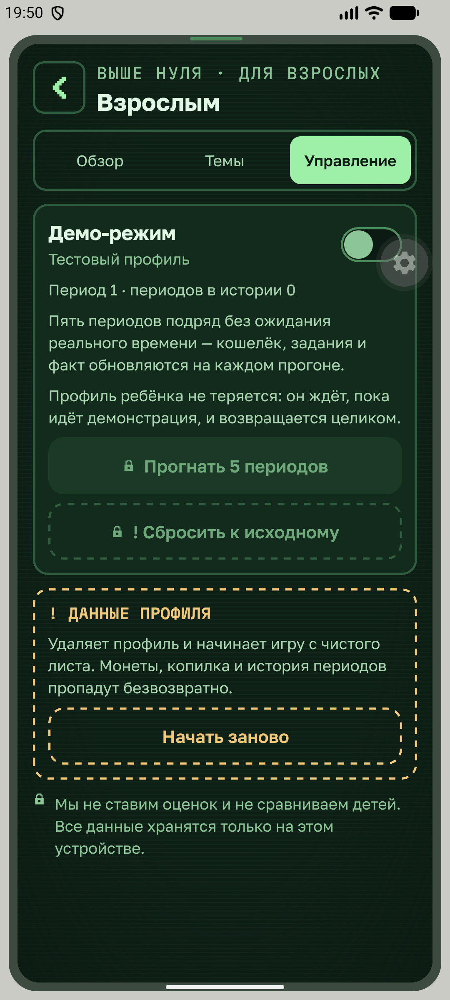

6. Подтвердить в диалоге **«Включить»**.

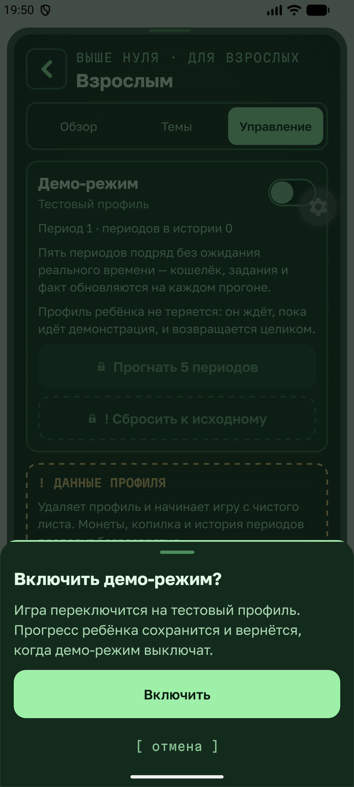

Результат:

- игра переключается на тестовый профиль (`Демо` / робот `Кузя-01`);
- прогресс ребёнка сохранён и ждёт возврата;
- становятся активны кнопки прогона и сброса демо-профиля.

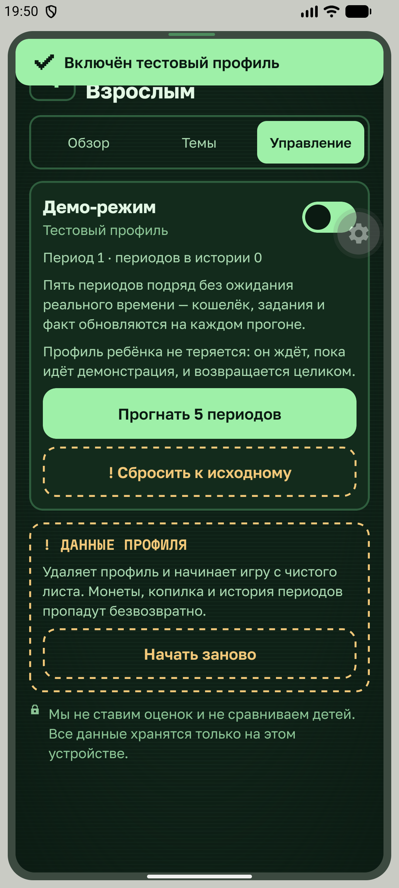

### Прогнать 5 периодов

1. Убедиться, что демо-режим **включён** (переключатель зелёный).
2. Нажать **«Прогнать 5 периодов»**.

Результат:

- обязательные этапы цикла (план → действия → итоги) проходят подряд;
- кошелёк, задания и факт обновляются на каждом периоде;
- без ожидания реального времени.

### Выйти из демо

1. В той же карточке **выключить** переключатель «Тестовый профиль».

Результат:

- профиль ребёнка возвращается как был (в том числе после перезапуска приложения
  во время демо);
- демошное имя не остаётся в сейве.

### Сброс тестового профиля

Кнопка **«Сбросить к исходному»** доступна только при включённом демо: возвращает
тестовый профиль к стартовому состоянию, не трогая припаркованный сейв ребёнка.

> Путь коротко: **шестерёнка → Для взрослых → пример / удержание → Управление →
> Демо-режим → включить → Прогнать 5 периодов**.

---

## Сценарий ребёнка

### 1. Первый запуск и профиль

1. Установить и открыть приложение (APK или отладочная сборка).
2. При первом запуске создаётся **локальный гостевой профиль** — без почты,
   телефона и настоящего имени.
3. Хранитель коротко объясняет три направления бюджета.

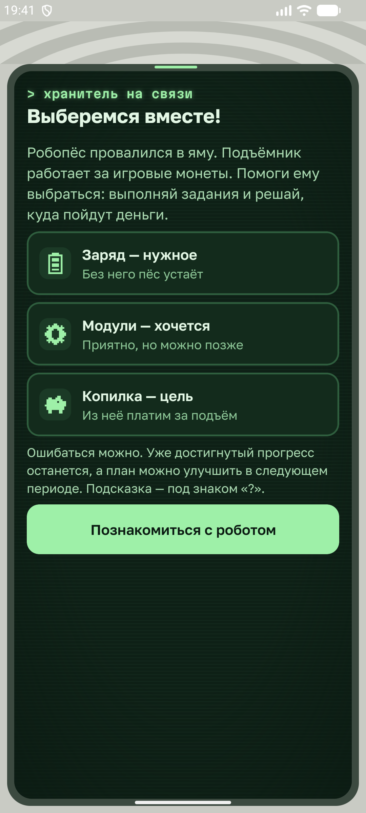

4. Указать **игровое имя**, **имя робопса**, окрас и модули внешности.

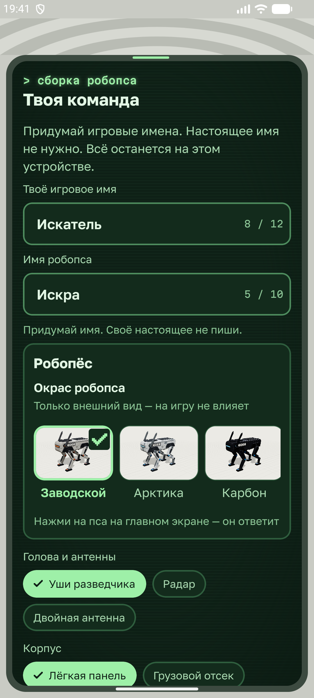

5. Подтвердить и пройти вступительную сцену (её можно пропустить).

Результат:

- профиль хранится только на устройстве;
- открывается главная сцена — яма с робопсом.

### 2. Главный экран (арена)

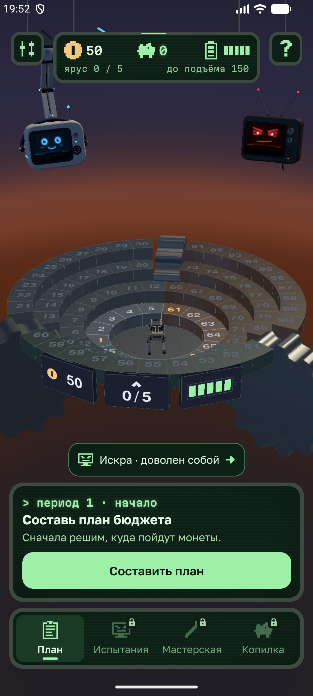

На арене видны:

- робопёс в центре платформы;
- три сектора с клетками-уроками;
- док внизу: **План**, **Испытания**, **Мастерская**, **Копилка**;
- шестерёнка настроек и подсказка «?»;
- терминалы двух ИИ над ареной:
  - **Хранитель** — план, магазин, копилка, отчёт, советы;
  - **Смотритель** — испытания, задания, мини-игры (аркада).

Действия:

1. Тап по клетке своего сектора — открыть урок.
2. Тап по клетке другого сектора — повернуть арену к нему.
3. Тап по кнопкам дока или экрану ИИ — открыть терминал.
4. Тап по собаке — короткая реакция персонажа.

### 3. План бюджета периода

Предусловие: период в фазе планирования (после старта или после итогов).

1. Открыть **План** в доке (или терминал Хранителя).
2. Распределить доступные монеты минимум по трём направлениям:
   - **заряд** — обязательное;
   - **модули / хотелки** — необязательное;
   - **копилка** — накопления на цель (подъём яруса).
3. Подтвердить план. В минус уйти нельзя: остаток виден сразу.

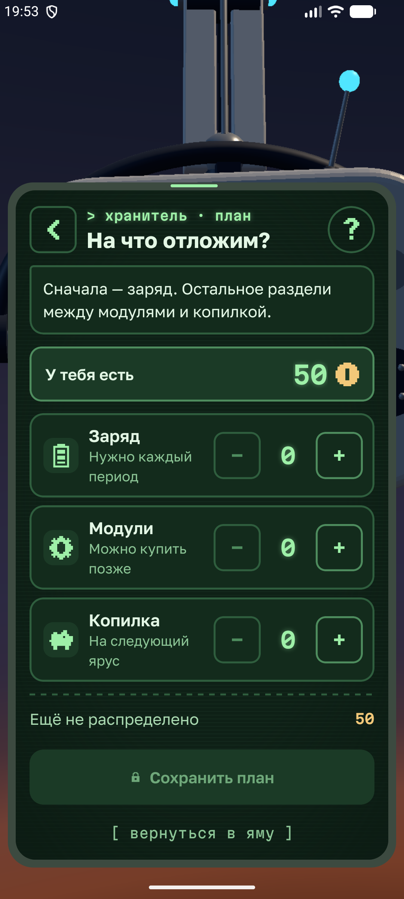

Результат:

- период переходит в активную фазу;
- магазин, задания и копилка открываются «по-настоящему».

### 4. Задания и уроки

1. Через **Испытания** / Смотрителя или клетки арены открыть задание / урок.
2. Ответить на вопросы или пройти механику.
3. Прочитать разбор (и при верном, и при неверном ответе).

Результат:

- на баланс приходят монеты с названным источником;
- ошибка не обнуляет прогресс — только замедляет.

### 5. Покупки

1. Открыть **Мастерскую** в доке.
2. Купить позицию из **обязательного** (заряд) и при желании из **желаемого**
   (модули, игрушки).
3. При нехватке монет — прочитать объяснение и варианты (заработать, взять из
   копилки, подождать).

Результат:

- монеты списываются с баланса;
- купленные игрушки открывают **пазлы** в мини-играх Смотрителя.

### 6. Копилка и подъём яруса

1. После подтверждённого плана открыть **Копилку** в доке.
2. Выбрать цель (например, следующий ярус) и пополнить накопления.
3. Когда сумма достаточна — подтвердить оплату подъёма.

Результат:

- монеты уходят из копилки;
- платформа поднимается на ярус; достигнутый ярус не откатывается.

### 7. Мини-игры (аркада)

1. Открыть терминал **Смотрителя** → раздел мини-игр / аркады.

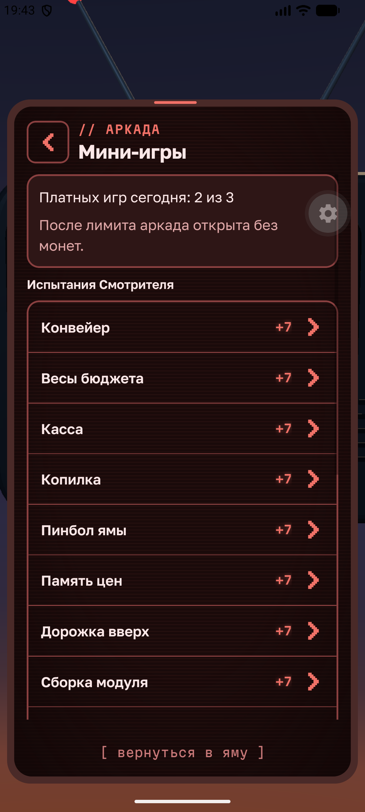

2. Сыграть финансовую игру, консоль, змейку, spacewar или пазл (если куплены
   игрушки).
3. Учесть лимит: **три оплачиваемых прохождения в день**; дальше можно
   тренироваться без новых монет.

Результат:

- награда за игру меньше, чем за хозяйственные задания — так и задумано;
- ошибка в раунде не обнуляет выплату полностью.

### 8. Завершение периода

1. Когда день отыгран — завершить период кнопкой на главном / в отчёте.
2. Посмотреть сравнение **план vs факт**.
3. При необходимости пройти шаг восстановления и начать новый период.

Результат:

- история кошелька и периодов обновляется;
- стадия сборки робопса может сдвинуться по итогам серии решений.

### 9. Перезапуск приложения

1. Закрыть приложение полностью.
2. Открыть снова.

Результат:

- профиль, баланс, покупки, копилка, цель и учебный прогресс на месте
  (п. 2.5.13 ТЗ).

---

## Сценарий взрослого

### 1. Вход в раздел «Взрослым»

Предусловие: на устройстве есть игровой профиль.

1. Главный экран → **настройки** (шестерёнка).
2. Кнопка **«Для взрослых»** внизу списка.
3. Барьер:
   - пример **A × B** (множители 6…9) и ответ на клавиатуре; или
   - удержание кнопки ~3 секунды.


4. Неверный ответ не блокирует: поле очищается, пример обновляется.

Результат:

- открывается служебный терминал с отчётом;
- данных ребёнка никуда не отправляется — всё считается локально.

### 2. Обзор и темы

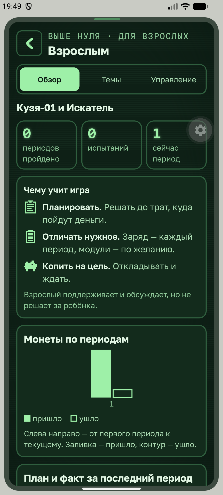

На вкладках раздела взрослый видит:

- состояние игры (игрок, робот, период);
- монеты по периодам;
- план и факт последнего периода;
- задания по темам;
- стадию сборки робота;
- коротко — чему учит игра.

Без негативных оценок ребёнка (п. 2.5.12 ТЗ).

### 3. Демо-режим

См. раздел **[Как попасть в демо-режим](#как-попасть-в-демо-режим)** выше —
это обязательный шаг экспертной демонстрации.

### 4. Сброс и удаление профиля

На вкладке **«Управление»**:

- сброс / удаление профиля — с явным подтверждением и названным последствием;
- удаление начинает игру с чистого гостевого профиля (монеты, копилка и история
  пропадут).

---

## Настройки ребёнка (без барьера)

В обычных настройках (шестерёнка), **до** раздела взрослых:


| Настройка | Зачем |
| --- | --- |
| Звук | Выключить щелчки и голоса ИИ |
| Анимации | Мгновенные переходы вместо движения |
| Язык | Русский / English / системный |
| Окрас и клип робопса | Только внешний вид |

Звук и анимации намеренно не спрятаны за умножение: это нужды самого ребёнка.

---

## Установка сборки для проверки

```sh
pnpm install
pnpm run keystore      # один раз
pnpm run build:apk     # build/mobile-hackathon-*.apk
adb install -r build/mobile-hackathon-*.apk
```

Подробности: [android-release.md](./android-release.md), чек-лист проверки —
[review-handoff.md](./review-handoff.md).

Рекомендуется пройти обязательный сценарий **в авиарежиме**.

---

## Краткая карта экранов

| Что | Как открыть | Скрин |
| --- | --- | --- |
| Арена | `/home` после setup | [home.png](user-guide/assets/home.png) |
| Настройки | шестерёнка на главной | [settings.png](user-guide/assets/settings.png) |
| **Демо-режим** | настройки → Для взрослых → барьер → Управление | [demo-enabled.png](user-guide/assets/demo-enabled.png) |
| План | док «План» | [plan.png](user-guide/assets/plan.png) |
| Аркада | Смотритель → мини-игры | [arcade.png](user-guide/assets/arcade.png) |
| Копилка | док «Копилка» (после плана) | — |

---

## Связанные документы

| Документ | О чём |
| --- | --- |
| [../../README.md](../README.md) | Быстрый старт и сборка |
| [concept.md](./concept.md) | Сюжет и связь с ТЗ |
| [parents.md](./parents.md) | Барьер и раздел взрослых |
| [game-period.md](./game-period.md) | Игровой период и демо |
| [privacy.md](./privacy.md) | Офлайн и отсутствие сбора данных |
| [requirements-matrix.md](./requirements-matrix.md) | Соответствие пунктам ТЗ |
