# Руководство пользователя

**Приложение:** «Выше нуля»  
**Платформа:** Android (прототип по ТЗ Департамента финансов города Москвы, 2026)  
**Аудитория:** дети 7–11 лет; взрослый сопровождает, но не решает вместо ребёнка

Скриншоты сняты с релизной сборки на эмуляторе Android (Pixel 6, 1080 × 2400),
русский язык: папка [`user-guide/assets/`](./user-guide/assets/).

## Назначение

Игра учит базовым навыкам карманных денег: планировать бюджет, различать
обязательное и желаемое, копить на цель и видеть последствия решений.

Ребёнок помогает **робопсу** выбраться из механической ямы: зарабатывает
монеты на испытаниях, уроках и мини-играх, составляет план, покупает заряд и
модули, откладывает в копилку и оплачивает подъём яруса. Наверху его ждёт
подружка — робокошка **Кнопка**. Всё работает **офлайн**, без аккаунта,
рекламы и реальных платежей.

Отдельно предусмотрен **раздел для взрослого** (отчёт и демо-режим) за
арифметическим барьером.

> Источник требований: ТЗ «Питомец Финни» / Департамент финансов города Москвы.
> В игре питомец — робопёс; термины ТЗ (обязательное / желаемое / накопления)
> сохранены.

---

## Как попасть в демо-режим

**Это основной способ экспертной проверки** (п. 2.5.13 ТЗ): тестовый профиль и
пять игровых периодов подряд без ожидания календарных сроков. Профиль ребёнка
при этом **не стирается** — он паркуется и возвращается целиком после выключения
демо.

### Шаги

1. На арене открыть **настройки** — кнопка с ползунками в левом верхнем углу.
2. Пролистать вниз и нажать **«Для взрослых»**.

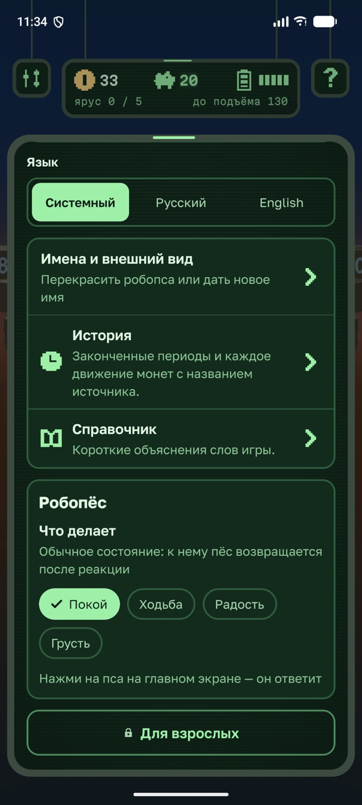

3. Пройти барьер одним из способов:
   - решить пример на умножение (множители **6…9**, например `7 × 6`) и нажать **OK**;
   - **или** удерживать кнопку «или удерживайте 3 секунды».

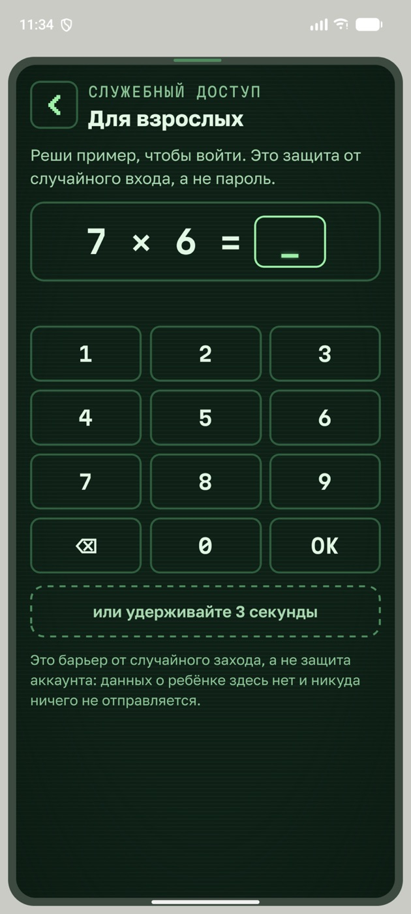

4. Открыть вкладку **«Управление»**.
5. В карточке **«Демо-режим»** включить переключатель **«Тестовый профиль»**.

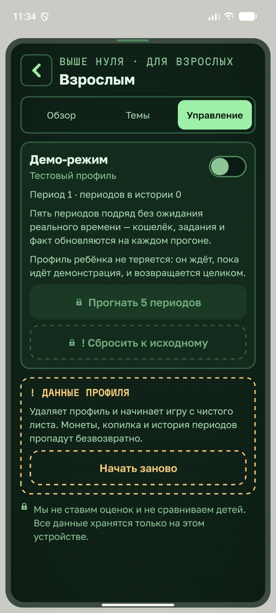

6. Подтвердить в диалоге **«Включить»**.

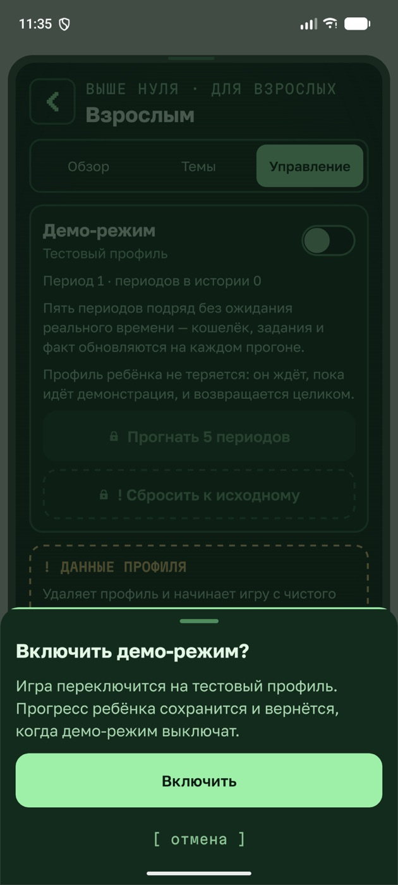

Результат:

- игра переключается на тестовый профиль, появляется уведомление
  «Включён тестовый профиль»;
- прогресс ребёнка сохранён и ждёт возврата;
- становятся активны кнопки **«Прогнать 5 периодов»** и **«Сбросить к исходному»**.

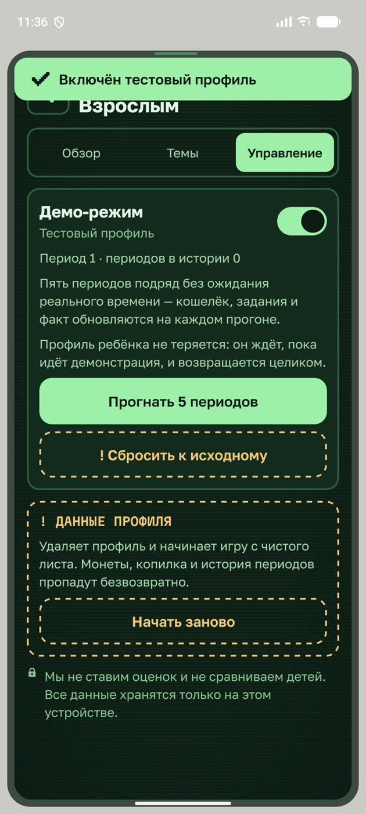

### Прогнать 5 периодов

1. Убедиться, что демо-режим **включён** (переключатель зелёный).
2. Нажать **«Прогнать 5 периодов»**.

Результат:

- обязательные этапы цикла (план → действия → итоги) проходят подряд;
- строка карточки меняется, например, на «Период 6 · периодов в истории 5»;
- кошелёк, задания и факт обновляются на каждом периоде, без ожидания реального времени.

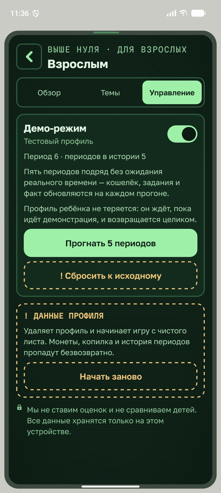

После выхода из раздела взрослых тестовый профиль начинается с комикса-пролога
(его можно пропустить), а затем открывается арена.

### Выйти из демо

1. Снова пройти в **настройки → Для взрослых → Управление**.
2. **Выключить** переключатель «Тестовый профиль».

Результат:

- профиль ребёнка возвращается как был (в том числе после перезапуска приложения
  во время демо);
- демо-профиль не остаётся в сохранении.

### Сброс тестового профиля

Кнопка **«Сбросить к исходному»** доступна только при включённом демо: возвращает
тестовый профиль к стартовому состоянию, не трогая припаркованный профиль ребёнка.

> Путь коротко: **настройки → Для взрослых → пример / удержание → Управление →
> Демо-режим → Включить → Прогнать 5 периодов**.

---

## Сценарий ребёнка

### 1. Первый запуск: сборка робопса

1. Установить и открыть приложение.
2. При первом запуске создаётся **локальный гостевой профиль** — без почты,
   телефона и настоящего имени.
3. Открывается экран сборки: сверху живой 3D-робопёс на бетонной площадке,
   снизу лист настройки. Кнопка комментирует каждый выбор.

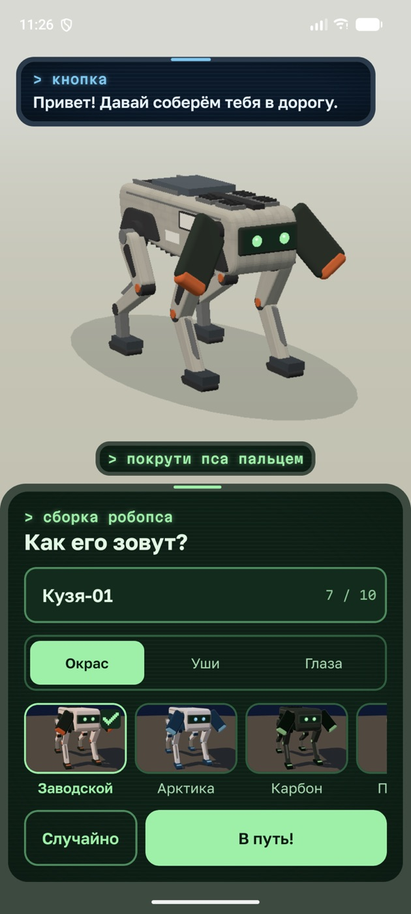

4. Ввести **имя робопса** (до 10 символов, по умолчанию «Кузя-01»).
5. Выбрать внешний вид на трёх вкладках:
   - **Окрас** — семь вариантов, ряд листается вбок;
   - **Уши** — лопухи, острые, локаторы;
   - **Глаза** — круглые, улыбка, огоньки.

   Выбор сразу применяется к 3D-модели, пёс подпрыгивает от радости.
   Пса можно покрутить пальцем и погладить тапом. Кнопка **«Случайно»**
   собирает случайный вариант.

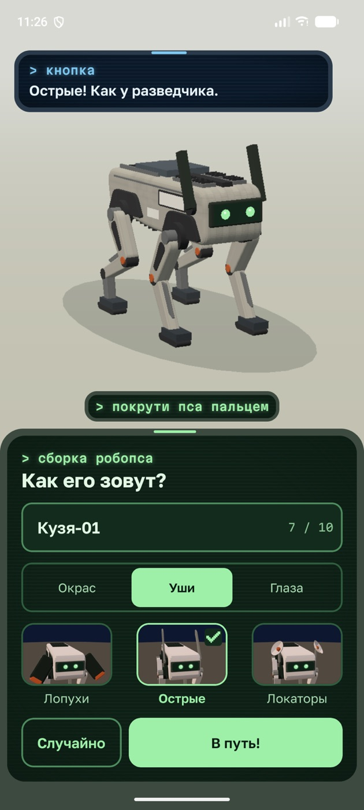

6. Нажать **«В путь!»**.

Результат:

- профиль хранится только на устройстве;
- игровое имя ребёнка не спрашивается: по умолчанию «Искатель», изменить можно
  в настройках.

### 2. Комикс-пролог

Шесть кадров: прогулка с Кнопкой, край ямы, падение. Листать кнопками
**«Дальше»** / **«Назад»**, пропустить — **«[ пропустить ]»** сверху.
Имя робопса подставляется в реплики.

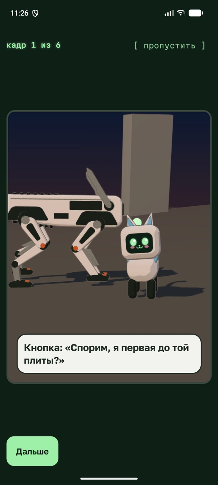

На последнем кадре кнопка **«Вперёд!»** открывает арену.

### 3. Арена

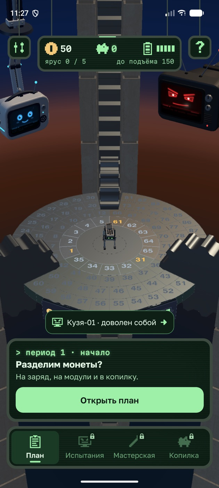

На арене видны:

- робопёс в центре платформы и три сектора со ступенями-клетками (уроки 1–90);
- табло сверху: монеты на руках, копилка, заряд, ярус и сколько осталось до подъёма;
- настройки (слева вверху) и подсказка «?» (справа вверху);
- два ИИ на кронштейнах: голубой **Хранитель** (план, мастерская, копилка,
  завершение периода) и красный **Смотритель** (испытания и мини-игры);
- плашка состояния пса («Кузя-01 · доволен собой») — открывает диагностику;
- карточка текущего шага и док внизу: **План**, **Испытания**, **Мастерская**, **Копилка**.

До первого плана **Испытания**, **Мастерская** и **Копилка** закрыты замком:
сначала нужно решить, куда пойдут деньги.

Действия на арене:

1. Тап по клетке **другого** сектора — повернуть арену к нему.
2. **Удержание** клетки своего сектора — открыть урок.
3. Тап по ИИ или кнопке дока — открыть терминал.
4. Тап по псу — короткая реакция и крупный план.

### 4. План бюджета периода

1. Нажать **«Открыть план»** (или **План** в доке).
2. Разложить монеты кнопками «−» / «+» (шаг 10) по трём коробкам:
   - **Заряд** — нужно каждый период (обязательное);
   - **Модули** — можно купить позже (желаемое);
   - **Копилка** — на следующий ярус (накопления).
3. Строка «Ещё не распределено» показывает остаток. Кнопка **«Сохранить план»**
   открывается, когда остаток равен нулю. Уйти в минус нельзя.

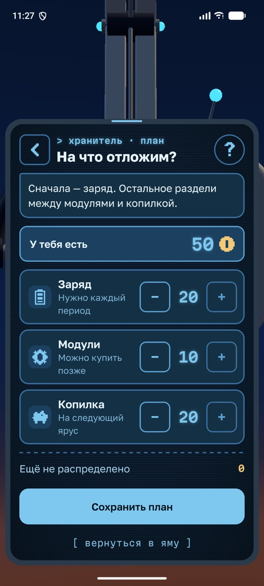

После сохранения лист «что изменилось» объясняет результат:

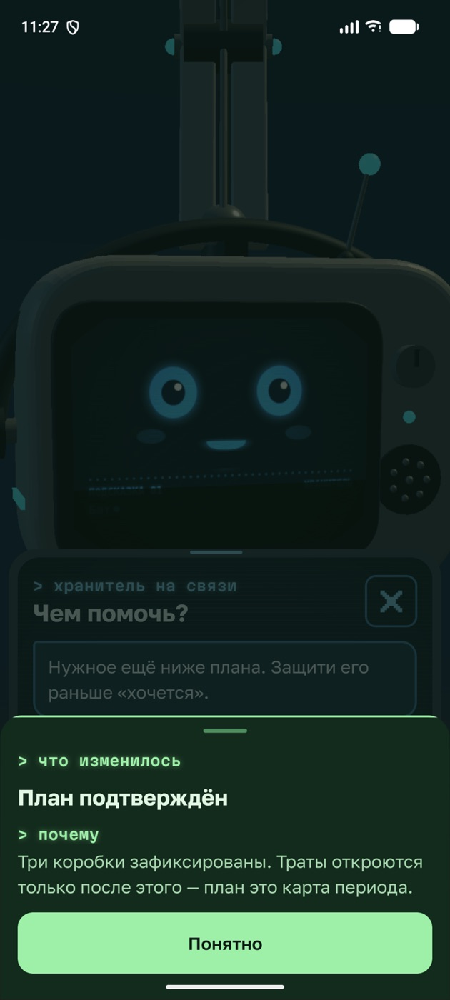

Результат: период переходит в активную фазу, открываются испытания,
мастерская и копилка, на арене появляется карточка активного испытания.

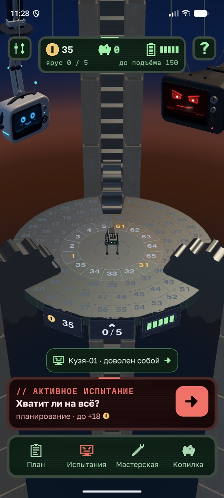

### 5. Хранитель: мастерская и покупки

Тап по Хранителю открывает его терминал: **Мастерская**, **Копилка и цели**,
**Завершить период**. Подсказка сверху советует, что сделать сейчас.

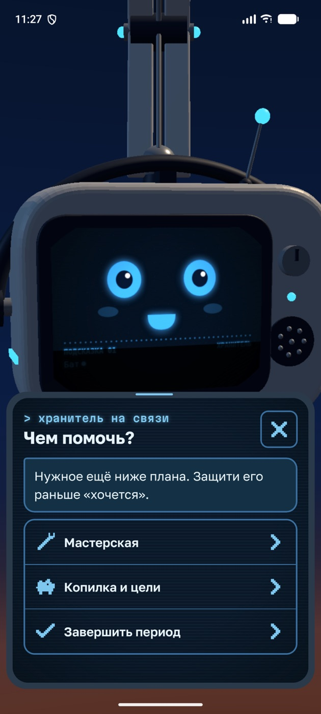

1. Открыть **Мастерскую** (через Хранителя или док).
2. На вкладке **Заряд** — батареи (обязательное), на вкладке **Модули** —
   улучшения и игрушки (желаемое). Строка «По плану на заряд» показывает,
   сколько из запланированного уже потрачено.

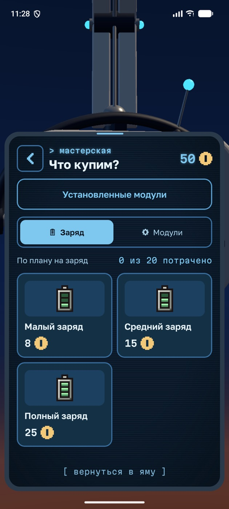

3. Тап по товару открывает карточку: что даст, как изменится кошелёк, в плане ли
   покупка. **«Купить»** или **«Не сейчас»**.

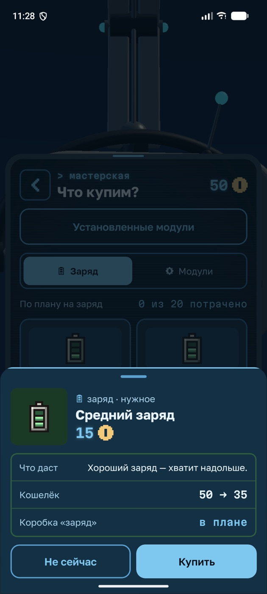

Результат: монеты списываются, факт по коробке растёт — это видно в разборе.

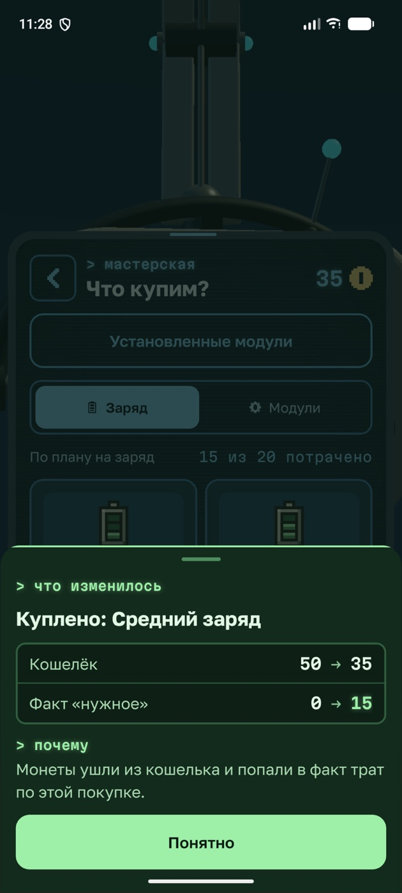

Если монет не хватает, приложение называет недостачу и варианты: выполнить
задание, взять из копилки или подождать. Купленные игрушки открывают пазлы в аркаде.

### 6. Копилка и подъём яруса

1. Открыть **Копилку** в доке.
2. Главная цель — **«Следующий ярус»** (150 монет), ниже — дополнительные цели.

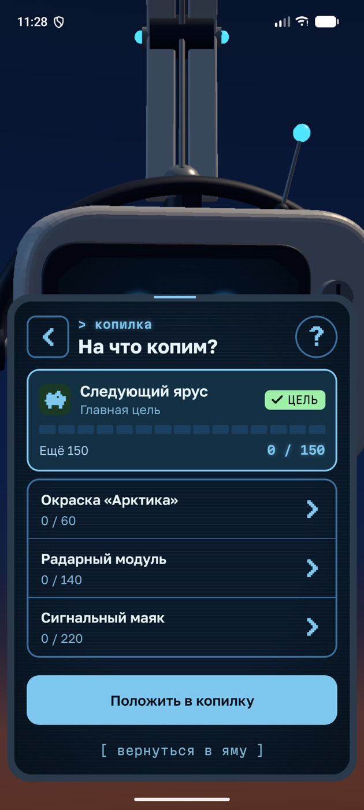

3. Нажать **«Положить в копилку»**, выбрать сумму («−» / «+», «+10», «+50», «Всё»)
   и подтвердить.

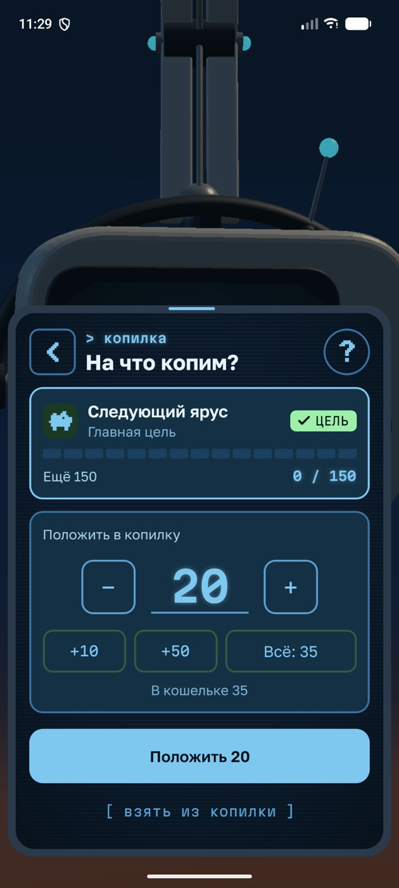

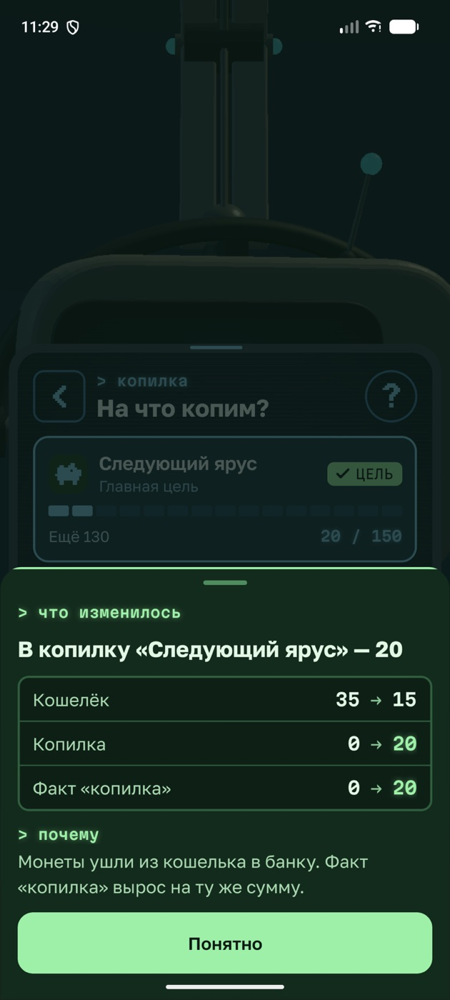

4. Когда цель собрана, подтвердить оплату подъёма. Платформа поднимается на ярус
   под анимацию; достигнутый ярус не откатывается. Пять ярусов — выход из ямы и финал.

Взять монеты обратно можно кнопкой **«[ взять из копилки ]»** — приложение покажет,
на сколько периодов отодвинется цель.

### 7. Испытания Смотрителя

1. Открыть **Испытания** в доке (или тап по Смотрителю).
2. Шесть испытаний по трём темам ТЗ: **План**, **Копить**, **Платить**;
   фильтр — чипами сверху. У каждого указана награда.

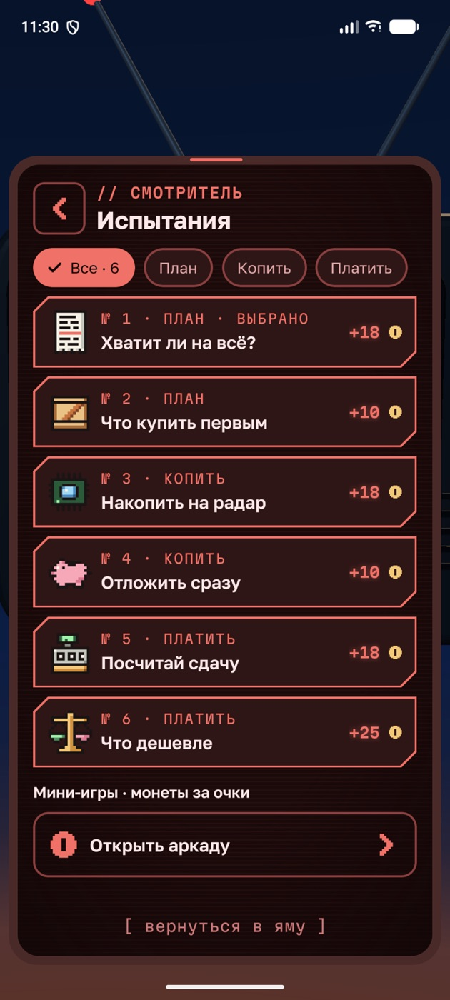

3. Выбрать испытание, ответить и нажать **«Проверить»**.

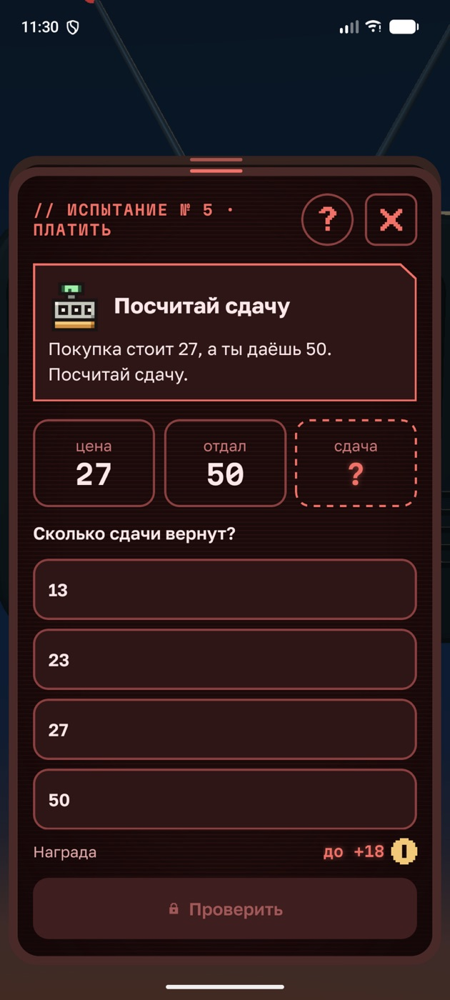

Результат: монеты приходят на баланс с названным источником, разбор объясняет
решение. Ошибка не обнуляет прогресс — только замедляет.

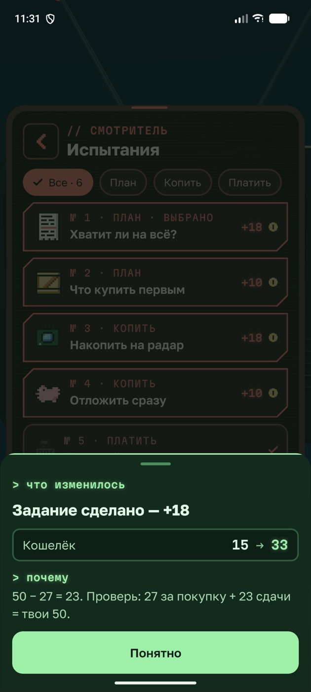

### 8. Уроки на ступенях

1. Повернуть арену к нужному сектору (тап по его клетке).

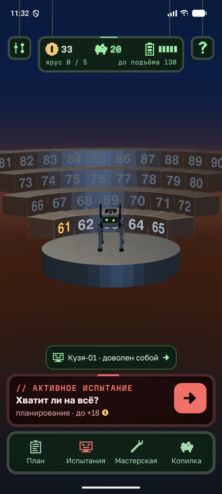

2. **Удерживать** открытую клетку около полсекунды — откроется урок.
3. Урок: три экрана теории → ситуация с выбором → три вопроса.
   В примерах стоит имя робопса.

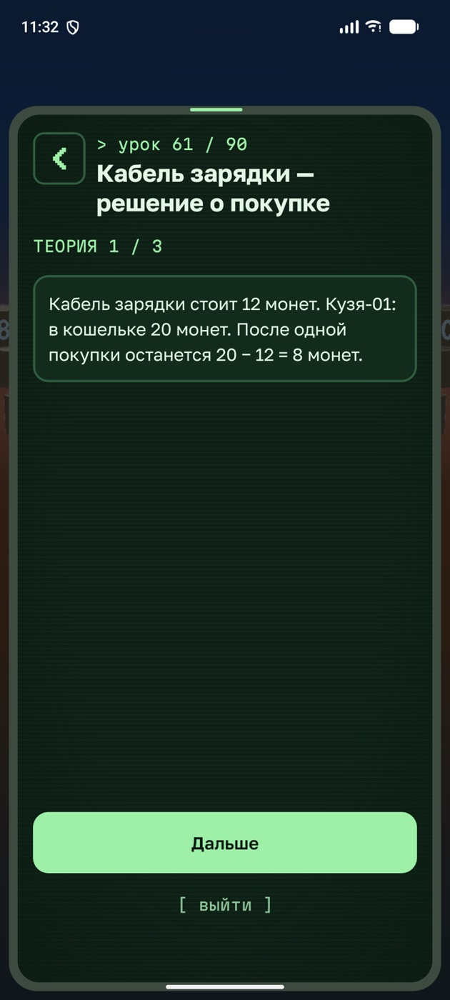

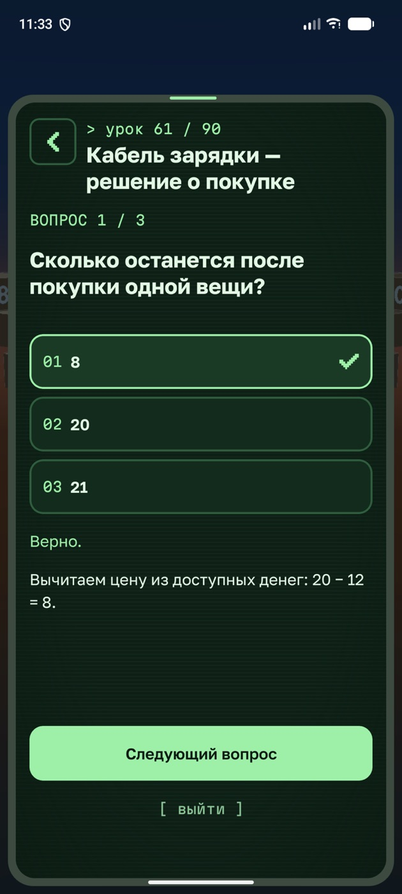

4. Итог: при достаточном числе верных ответов клетка становится зелёной;
   иначе — «Попробовать ещё раз». Кнопка **«выйти»** возвращает на арену.

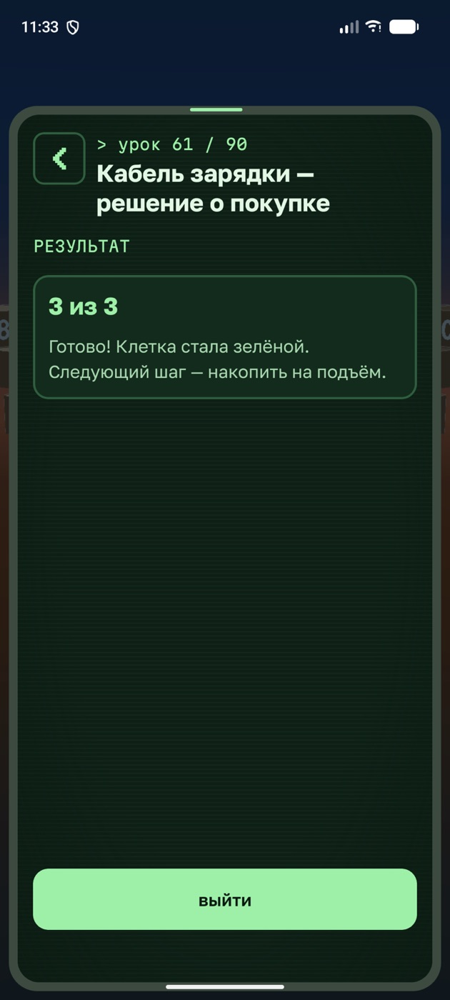

Ряд ступени открывается целиком: когда платформа на его уровне и предыдущий ряд
темы пройден.

### 9. Мини-игры (аркада)

1. Испытания → **«Открыть аркаду»**.
2. Сверху — лимит: **три оплачиваемых прохождения в день**, дальше аркада открыта
   без монет.

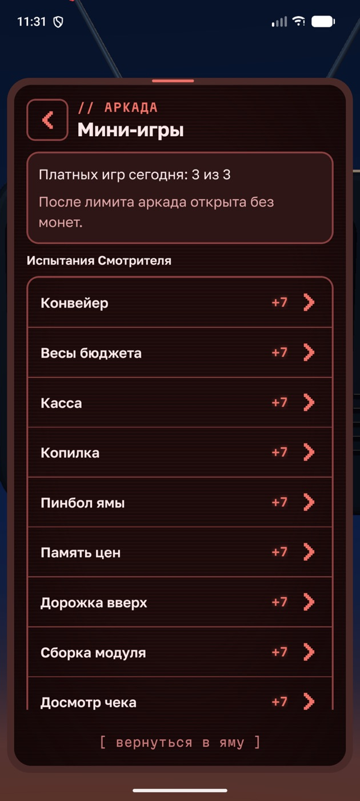

3. Выбрать игру. Каждая идёт раундами («Раунд 1 из 3»), без таймера;
   ошибка не штрафуется.

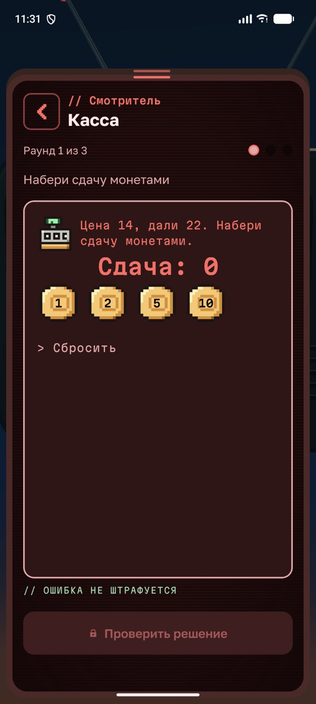

Результат: награда за игру меньше, чем за испытания, — так и задумано. Раунды
фиксированы на день: вернувшись, ребёнок получит те же задачи.

### 10. Диагностика робопса

Тап по плашке «Кузя-01 · доволен собой» открывает крупный план пса и его
диагностику: настроение с причиной и три стадии сборки
(**Базовая → Улучшенная → Полная**) с условиями перехода. Стадия растёт от
решений за несколько периодов, а не от покупок, и не откатывается.

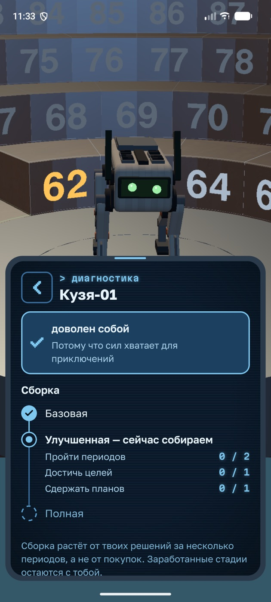

### 11. Завершение периода

1. Хранитель → **«Завершить период»**.
2. Посмотреть сравнение **план vs факт** и бонусы.
3. Составить план следующего периода.

Результат: история кошелька и периодов обновляется; при серии удачных решений
стадия сборки робопса растёт — это показывает отдельный экран.

### 12. Перезапуск приложения

1. Закрыть приложение полностью.
2. Открыть снова — экран «С возвращением!» → **«Продолжить»**.

Результат: профиль, баланс, покупки, копилка, цель и учебный прогресс на месте
(п. 2.5.13 ТЗ).

---

## Сценарий взрослого

### 1. Вход в раздел «Взрослым»

1. Арена → **настройки** → **«Для взрослых»** внизу списка.
2. Барьер: пример **A × B** (множители 6…9) на цифровой клавиатуре → **OK**,
   или удержание кнопки ~3 секунды.
3. Неверный ответ не блокирует: поле очищается, пример обновляется.

Данные ребёнка никуда не отправляются — всё считается локально.

### 2. Обзор

Имена пса и игрока, число пройденных периодов и испытаний, текущий период,
«Чему учит игра» и график монет по периодам (пришло / ушло).

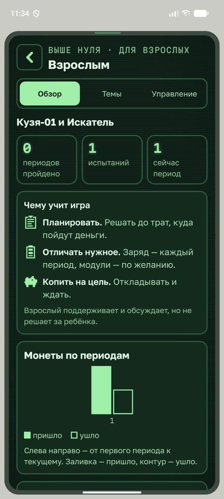

### 3. Темы

Сколько заданий ребёнок выполнил по каждой теме (планирование, накопления,
платежи) и вопрос для разговора дома. Без оценок и сравнений (п. 2.5.12 ТЗ).

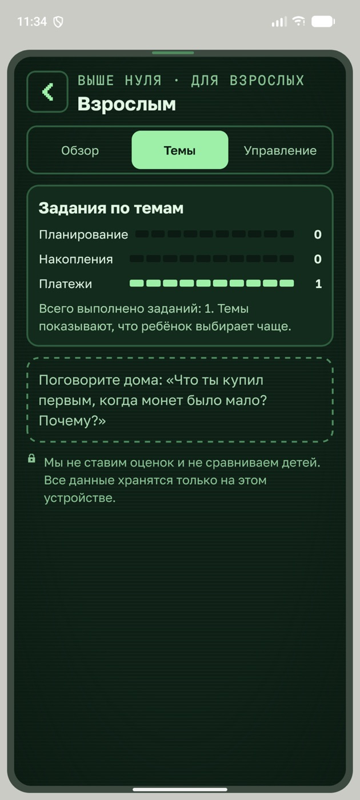

### 4. Управление

- **Демо-режим** — см. [Как попасть в демо-режим](#как-попасть-в-демо-режим).
- **Данные профиля → «Начать заново»** — удаляет профиль с явным подтверждением;
  монеты, копилка и история пропадут.

---

## Настройки ребёнка (без барьера)

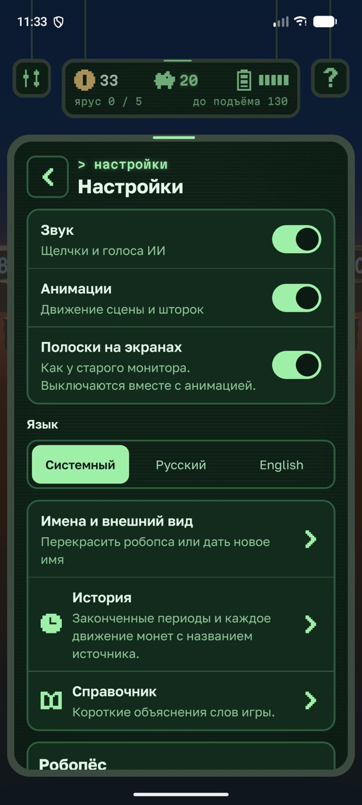

| Настройка | Зачем |
| --- | --- |
| Звук | Выключить щелчки и голоса ИИ |
| Анимации | Мгновенные переходы вместо движения |
| Полоски на экранах | Эффект старого монитора |
| Язык | Системный / Русский / English |
| Имена и внешний вид | Игровое имя, имя робопса, окрас, уши, глаза |
| Робопёс → Что делает | Покой, ходьба, радость, грусть — обычное состояние пса |

Лист **«Имена и внешний вид»** использует тот же выбор, что и первый экран:

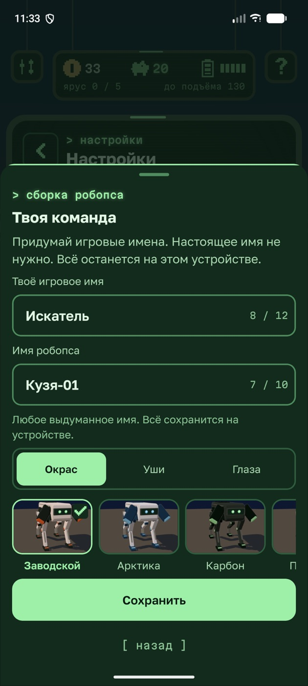

Звук и анимации намеренно не спрятаны за умножение: это нужды самого ребёнка.

---

## Установка сборки для проверки

```sh
pnpm install
pnpm run keystore      # один раз
pnpm run build:apk     # build/mobile-hackathon-*.apk
adb install -r build/mobile-hackathon-*.apk
```

Подробности: [android-release.md](./android-release.md), чек-лист проверки —
[review-handoff.md](./review-handoff.md).

Рекомендуется пройти обязательный сценарий **в авиарежиме**.

---

## Краткая карта экранов

| Что | Как открыть | Скрин |
| --- | --- | --- |
| Сборка робопса | первый запуск | [setup.jpg](user-guide/assets/setup.jpg) |
| Арена | после комикса / «Продолжить» | [home.jpg](user-guide/assets/home.jpg) |
| План | «Открыть план» / док «План» | [plan.jpg](user-guide/assets/plan.jpg) |
| Мастерская | док «Мастерская» / Хранитель | [shop.jpg](user-guide/assets/shop.jpg) |
| Копилка | док «Копилка» (после плана) | [savings.jpg](user-guide/assets/savings.jpg) |
| Испытания | док «Испытания» / Смотритель | [trials.jpg](user-guide/assets/trials.jpg) |
| Урок | удержание клетки своего сектора | [lesson-theory.jpg](user-guide/assets/lesson-theory.jpg) |
| Аркада | Испытания → «Открыть аркаду» | [arcade.jpg](user-guide/assets/arcade.jpg) |
| Диагностика пса | плашка состояния над доком | [diagnostics.jpg](user-guide/assets/diagnostics.jpg) |
| Настройки | кнопка слева вверху | [settings.jpg](user-guide/assets/settings.jpg) |
| **Демо-режим** | настройки → Для взрослых → барьер → Управление | [demo-enabled.jpg](user-guide/assets/demo-enabled.jpg) |

---

## Связанные документы

| Документ | О чём |
| --- | --- |
| [../README.md](../README.md) | Быстрый старт и сборка |
| [concept.md](./concept.md) | Сюжет и связь с ТЗ |
| [parents.md](./parents.md) | Барьер и раздел взрослых |
| [game-period.md](./game-period.md) | Игровой период и демо |
| [privacy.md](./privacy.md) | Офлайн и отсутствие сбора данных |
| [requirements-matrix.md](./requirements-matrix.md) | Соответствие пунктам ТЗ |
